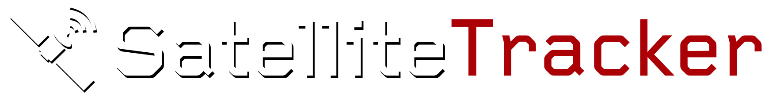
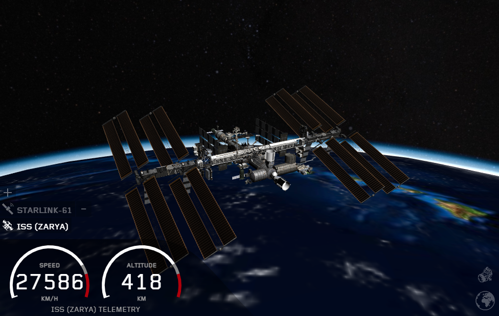
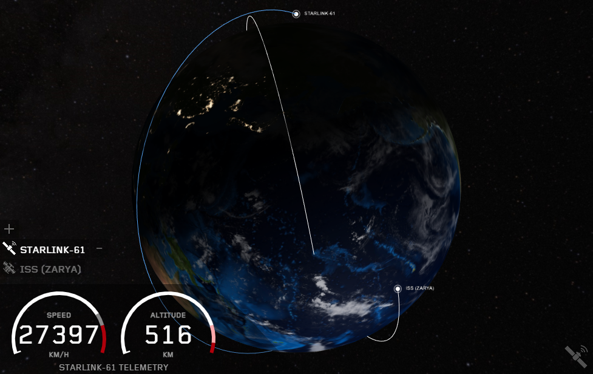

A real-time satellite tracker in 3D. 
[satellitetracker.net](https://satellitetracker.net)

Especially made to enjoy the view from the International Space Station in real-time. 
Everything that is visualized like earth, sun and moon is in original scale and at the exact position in space at this time.

You can see or track live the position and the future orbit of any satellite.

The design is inspired by SpaceX.